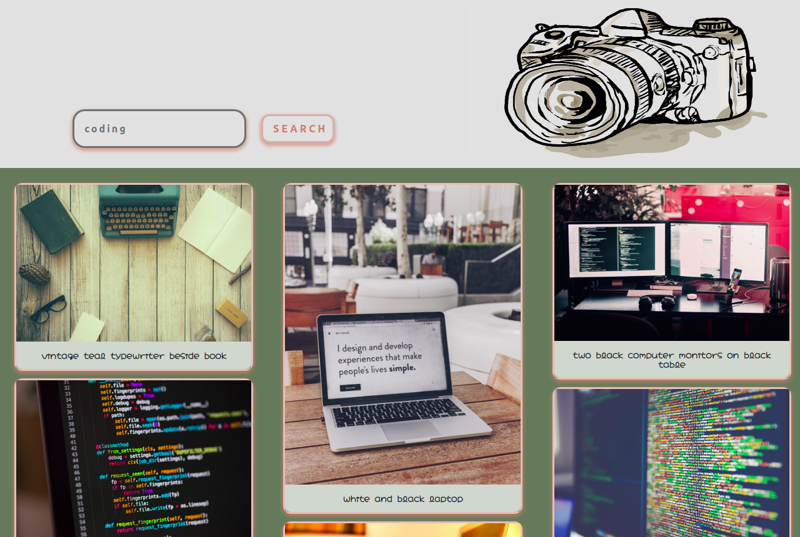

Click [here](https://belccarvalho.github.io/Photos-Search/) to access the page

This project was done during the one-year Web Development Course. Its objective is to exercise the use of API. The infinite-scrolling was implemented as extra feature during the tutoring activities with the help of [Alice Rez](https://github.com/Alice-Rez).

#### Main used Technologies:

- React
- React Hooks
- API (Axios)
- Bootstrap
- Infinite scrolling

###Responsive Webdesign

